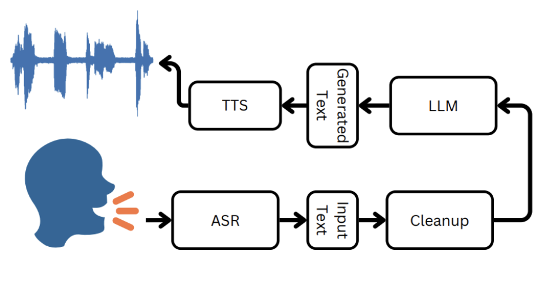

# Persian Spoken Dialogue System
🔥 In this repo we fine-tuned 3 parts of this model to achive a rich SDS for Persian language 🔥 :
1. Automatic Speech Recognition : Convert speech to text : Whisper model is fine-tuned
2. Large Language Model : Generate the answer : LLAMA-3-8b-instruct, Gemma2, Mistral are fine-tuned using adaptor
3. Text To Speech : Convert textual answer to speech : speecht5 model is fine-tuned
   
📘 Full report is also available <a href = "https://github.com/Alidr79/Persian-Spoken-Dialogue-System/blob/main/Speech%20Project%20Documentation.pdf">Link</a>

References :
1. Gong, Yuan, et al. "Whisper-at: Noise-robust automatic speech recognizers are also strong general audio event taggers." arXiv preprint arXiv:2307.03183 (2023).
2. Jiang, Albert Q., et al. "Mistral 7B." arXiv preprint arXiv:2310.06825 (2023).
3. Team, Gemma, et al. "Gemma: Open models based on gemini research and technology." arXiv preprint arXiv:2403.08295 (2024).
4. Touvron, Hugo, et al. "Llama: Open and efficient foundation language models." arXiv preprint arXiv:2302.13971 (2023).
5. Ao, Junyi, et al. "Speecht5: Unified-modal encoder-decoder pre-training for spoken language processing." arXiv preprint arXiv:2110.07205 (2021).
   

<h2>Inference</h2>
We have also implemented this work using gradio in jupyter note book which you can run it in colab.

